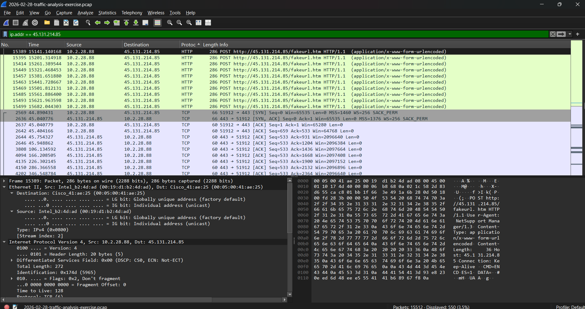
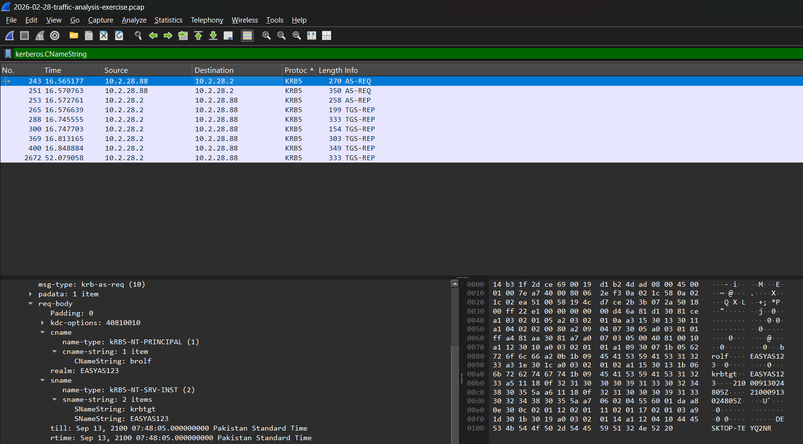
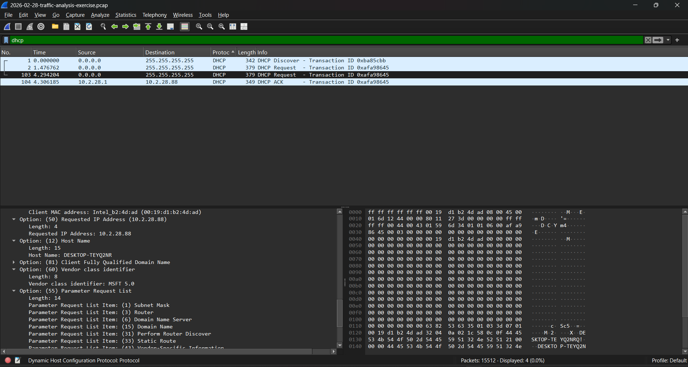
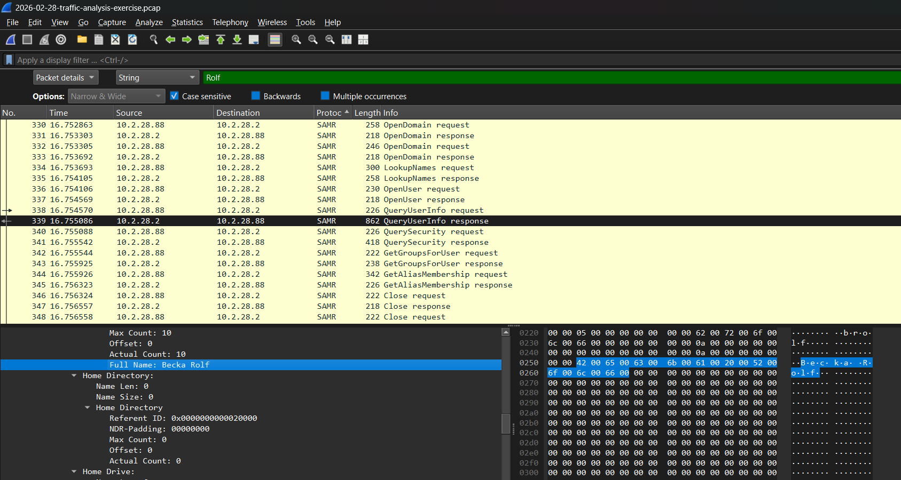

# 🌐 Network Traffic Analysis & Malware PCAP Investigation


---

## 📌 Project Overview

This project demonstrates real-world **network traffic analysis** skills used daily in SOC environments. It covers two key scenarios:

1. **Live traffic capture and analysis** using Wireshark filters
2. **Malware PCAP investigation** — identifying an infected host from a real NetSupport Manager RAT infection

---

## 🏗️ Lab Setup

```
┌─────────────────────────────────────────────────┐
│              Windows 11 Host Machine            │
│                                                 │
│  ┌───────────────────────────────────────────┐  │
│  │  Wireshark                                │  │
│  │  Live Traffic Capture                     │  │
│  │  Malware PCAP Analysis                    │  │
│  └───────────────────────────────────────────┘  │
│                                                 │
│  Traffic Sources:                               │
│  • Live network interface capture              │
│  • Malware PCAP from malware-traffic-          │
│    analysis.net                                │
└─────────────────────────────────────────────────┘
```

---

## 🛠️ Tools & Technologies

| Tool | Purpose |
|---|---|
| Wireshark | Packet capture and traffic analysis |
| DHCP Analysis | Host identification |
| Kerberos Analysis | User account identification |
| MITRE ATT&CK | Threat classification and mapping |

---

## 📋 Part 1 — Live Traffic Capture & Analysis

### Wireshark Filters Used

```wireshark
# DNS traffic analysis
dns

# HTTP traffic analysis
http

# TCP handshake detection
tcp.flags.syn == 1

# ICMP ping traffic
icmp

# Failed/reset connections
tcp.flags.reset == 1

# HTTP requests only
http.request

# Executable downloads
http.request.uri contains ".exe"
```

### What Was Analyzed
- DNS query patterns and responses
- HTTP request/response pairs
- TCP connection establishment (3-way handshake)
- ICMP traffic patterns
- Failed connection attempts

---

## 🦠 Part 2 — Malware PCAP Investigation

### Scenario Background

> SIEM alerts fired for **NetSupport Manager RAT** communicating with external C2 server `45.131.214[.]85` over TCP port 443. Starting at **2026-02-28 19:55 UTC**.
>
> Task: Analyze the PCAP and identify the infected host for the incident report.

### Environment Details

| Field | Value |
|---|---|
| LAN Segment | 10.2.28.0/24 |
| Domain | easyas123.tech |
| AD Environment | EASYAS123 |
| Domain Controller | 10.2.28.2 - EASYAS123-DC |
| Gateway | 10.2.28.1 |

---

### 🔍 Investigation Methodology

#### Step 1 — Identify C2 Communication
```wireshark
ip.addr == 45.131.214.85
```
Filtered all traffic to/from the malicious IP to identify the internal infected host.

#### Step 2 — Extract MAC Address
```wireshark
ip.addr == 10.2.28.88
```
Expanded **Ethernet II** frame to extract source MAC address of infected host.

#### Step 3 — Identify Hostname
```wireshark
dhcp
```
Analyzed **DHCP Request** packets → Expanded **Option 12 (Host Name)** to extract hostname.

#### Step 4 — Extract Username & Full Name
```wireshark
kerberos
```
Analyzed **Kerberos AS-REQ** packets → Extracted **CNameString** for username.

---

### 📊 Investigation Findings

| Field | Value |
|---|---|
| **Infected IP** | 10.2.28.88 |
| **MAC Address** | 00:19:d1:b2:4d:ad |
| **Hostname** | DESKTOP-TEYQ2NR |
| **Username** | brolf |
| **Full Name** | Becka Rolf |
| **C2 Server** | 45.131.214[.]85 |
| **C2 Port** | TCP 443 |
| **Malware** | NetSupport Manager RAT |

---

## 📝 SOC Incident Report

**Report Reference:** IR-2026-001
**Severity:** 🔴 HIGH
**Date:** 2026-02-28

### Incident Timeline

| Time (UTC) | Event |
|---|---|
| 2026-02-28 19:55 | SIEM signature hits for NetSupport Manager RAT |
| 2026-02-28 19:55+ | C2 communication established to 45.131.214[.]85 |
| 2026-04-20 | PCAP retrieved and analyzed |
| 2026-04-20 | Infected host identified — report generated |

### MITRE ATT&CK Mapping

| Tactic | Technique | ID |
|---|---|---|
| Command & Control | Application Layer Protocol: Web Protocols | T1071.001 |
| Command & Control | Remote Access Software | T1219 |
| Defense Evasion | Encrypted Channel: Asymmetric Cryptography | T1573.002 |

### Containment Recommendations

| Priority | Action |
|---|---|
| 🔴 IMMEDIATE | Isolate DESKTOP-TEYQ2NR from the network |
| 🔴 IMMEDIATE | Block 45.131.214[.]85 on perimeter firewall |
| 🟡 HIGH | Reset credentials for user brolf |
| 🟡 HIGH | Scan all endpoints for NetSupport Manager RAT |
| 🟢 MEDIUM | Review email logs for phishing on brolf's account |
| 🟢 MEDIUM | Check AD logs for lateral movement from 10.2.28.88 |

### Indicators of Compromise (IOCs)

```
IP Address:   45.131.214[.]85
Port:         443/TCP
Malware:      NetSupport Manager RAT
Hostname:     DESKTOP-TEYQ2NR
MAC Address:  00:19:d1:b2:4d:ad
Username:     brolf
```

---

## 📸 Screenshots

### Live Traffic Capture


### C2 Traffic Filter


### DHCP Hostname Extraction


### Kerberos Username Extraction


---

## 📂 Repository Structure

```
Network-Traffic-Analysis-Wireshark/
├── README.md
├── screenshots/
│   ├── live-capture.png
│   ├── c2-traffic-filter.png
│   ├── dhcp-hostname.png
│   └── kerberos-username.png
└── reports/
    └── IR-2026-001-NetSupportRAT.md    ← Full incident report
```

---

## 🎯 Key Takeaways

- Hands-on experience with professional Wireshark analysis techniques
- Ability to identify infected hosts from network traffic alone
- Understanding of how RAT malware uses port 443 to blend in with legitimate HTTPS traffic
- Experience writing professional SOC incident reports
- MITRE ATT&CK framework applied to real malware traffic analysis

---

## 🔗 Related Projects

- [Project 1 — Wazuh SIEM Deployment](https://github.com/qadirbux007/SOC-Home-Lab-Wazuh)
- [Project 2 — Wazuh EDR with Sysmon](https://github.com/qadirbux007/Wazuh-EDR-Sysmon-MITRE)
- [Project 4 — Incident Response with Microsoft Sentinel](https://github.com/qadirbux007/Incident-Response-Sentinel)

---

*Part of my SOC Portfolio Series — building hands-on experience for MSSP roles.*
